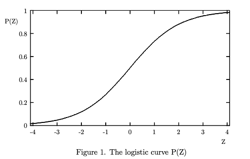
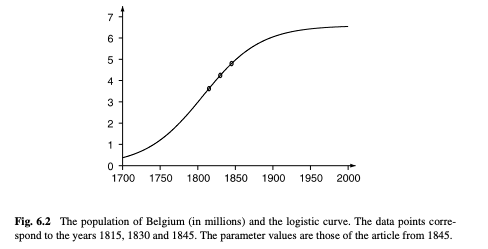

# Writing and Building Logistic Regression from Scratch

Logistic Regression, even though it's often thought of the counterpart to Linear Regression (i.e. "I use Linear Regression for Regression problems and Logistic Regression for Classification problems when I start with simple models") is actually an awesome model to explore a lot of the math used in ML. It's got a little bit of everything - probability, least squares, gradient descent, exponentiation, Bernouli likelihood, and some ways to think about data geometrically.

So where to start? The history of this model is instructive towards the types of problems we're seeking to solve, so let's begin there.

## Population Growth

Logistic Regression owes most of its raison de etre to population growth. We can start at Thomas Robert Malthus's "if nothing checks it, population grows multiplicately" (i.e. there's a geometric progression) is a solid start of the whole story. Malthus was controversial at the time and in today's climate, he's likely to not have many supporters. He was using his oberservations on population growth to support some pretty reprehensible views about the poor. 

His views are published and Adolphe Quetelet seems pretty intent on refuting these claims. I'm unclear if Quetelet was on his quest because of math or because of the sociological/political (or neither), but it does seem to me that Malthus was a motivating factor for Quetelet's _A Treatise on Man and the Development of his Faculties_. 

So when Adolphe Quetelet published _A Treatise on Man and the Development of his Faculties_ he directly addresses this concept of geometric/exponential/unchecked growth. 

In _Treatise_, Quetelet has some core ideas that we might remember from the last blog post ([Linear Regression from Scratch](https://blog.kevincoyle.xyz/blog/blogpost-191028)):
1. The "Average Man." In any population, many measurements cluster around a central value. Quetelet treats the mean as a type
2. Populations could not grow geometrically over a long period of time

The first concept might sound a lot like how plotting height and then noticing that there is a tendency to revert to a mean. I don't know of any direct linking of Carl Friedrich Gauss or Adrien-Marie Legendre's work on least squares in the early 19th century nor Sir Francis Galton's work on regression to Quetelet's application of the normal curve on human and social data. But the method of least squares was in the air. Quetelet ended up as a statistician by way of astronomy, where least squares was standard. Now enter Verhulst. 

Now the stage is set to birth the logistic regression model. 

We started with Pierre François Verhulst, by discussing his teacher and friend, Quetelet, who we believe is influenced by Malthus. Anywho, Verhulst had just started a role as a mathematics professor in 1835. Verhulst is teaching mathematics, but is also keen on politics. I can imagine that a statistician (Quetelet) focused on social sciences and a mathematician who has a strong interest in politics would get along famously. Quetelet publishes _Treatise_ and he believes that even in the abscence of just some sort of preventive checks (like the kind that Malthus recommended by way of reduced births via delayed marriage or “moral restraint”) or positive checks (like raised deaths via famine, disease, war) there had to be an end to exponential growth. This resource limit is where we first see a _logistic_ called _carrying capacity_. Etymology/word collision note: if you have spent any time in the corporate or military world, you've probably heard of "logistics" and it might feel like the movement and allocation of resources is similar to this but logistic here is different. Logistic was the term Verhulst used to describe the curve and its roots are from Greek logistikos. Anywho - back to math stuff. Verhulst and Quetelet are convinced that there is some upper limit on exponential growth of populations. So Verhulst publishes a series of papers wherein he adds an extra term to represent how that population eventually resists further growth. 

Here's a quote from a super highly cited paper on the history of Logistic Regression titled _The Origins of Logistic Regression_, J.S. Cramer, 2002
> The logistic function was invented in the 19th century for the description of the growth of populations and the course of autocatalytic chemical reactions. In either case we consider the time path of a quantity W(t) and its growth rate W(t) = dW(t)/dt. The simplest assumption is that W(t) is proportional to W(t) W(t) = BW(t), B = W(t)/W(t), with & the constant rate of growth. This leads of course to exponential growth W(t) = A exp Bt, where A is sometimes replaced by the initial value W(0). This is a reasonable model for unopposed population growth in a young country like the United States in its early years; as Malthus (1789) put it, a human population, left to itself, will increase in geometric progression.' But Alphonse Quetelet (1795- 1874), the Belgian astronomer turned statistician, was well aware that the indiscriminate extrapolation of exponential growth must lead to impossible values. He experimented with several adjustments of and also asked his pupil Pierre-Francois Verhulst. (1804-1849) to look into the problem.

This is all kind of interesting but what about the math you might be asking. 

Well let's think about three of the mathematical properties we just mentioned for a second. We have exponential growth and then growth that follows a logistic curve. Also, we have a guy who is convinced that there's something to this normal distribution. 
 

Notice the similarity with the normal distribution? From Cramer:

> Over a fairly wide central range, for values of P from .3 to .7, the logistic curve closely resembles in shape as the normal probability distributior function.

Verhulst developed this idea of the logistic curve over the course of 3 different papers under the supervision of Quetelet.

> We shall not insist on the hypothesis of geometric progression, given that it can hold only in very special circumstances; for example, when a fertile territory of almost unlimited size happens to be inhabited by people with an advanced civilization, as was the case for the first American colonies.

Notice that only in America can things grow indefinitely. 😉

Verhulst says that you can figure out this logistic curve with as little as three measurements. So for example, given the estimates of the population of Belgium in 1815, 1830, and 1845, (respectively 3.627, 4.247 and 4.801 million) he predicts a population of 4.998 million in 1851. 

If you plot that out:

Now that we have a little background on the logistic curve, let's talk a bit about odds. We'll come back to the math of the logistic curve to build up even more of an intuition, but hopefully, seeing how these ideas developed will give a bit of an intuition on what the shape of these curves do. 

## What are the odds

In probability theory, odds are a way to describe the probability of a potential outcome. Odds are usually described as a ratio and they have a "simple relationship" with probability. This can feel kind of like circular logic to me sometimes (see image below). But this circular relationship is instructive.

The math here isn't insanely hard - probability is between 0 and 1. We usually represent it as a percentage. It's the likelihood that an event might occur. Take a 6 sided die for example. Say we want to figure out "what is the probability that I roll a 4." Put another way: what is the chance that I roll and a specific number is face up? There are six sides, and we are figuring out 1 possible event that may occur, so our probability is 1 in 6, which we denote in division like 1/6, which is 0.16667 or 16.67%.  Now to move that to odds... With the formula above we have  

$$
\text{Odds} = \frac{\text{Probability}}{1-\text{Probability}}
$$
becomes
$$
\text{Odds} = \frac{0.1667}{1-0.1667}
$$
which is 0.2

We usually represent this as a ratio 1:5. The ratio is kind of instructive - we have 1 chance to get the outcome we want, and 5 chances to get the outcome we don't want. 

The final calculated numbers are different, because we're talking about two different ways to describe an _event_ in a _sample space_. In probability, the **sample space** $\Omega$ is the set of all outcomes that can happen. An **event** $E$ is any subset of $\Omega$ that we care about (e.g., “roll a 4”). For a fair six-sided die, $\Omega=\{1,2,3,4,5,6\}$. If all outcomes are equally likely, the probability of an event is the fraction of outcomes that make it happen: $P(E)=|E|/|\Omega|$. The **odds in favor** of $E$ compare the number of ways $E$ can occur to the number of ways it does not:

$$
\text{odds}(E)=\frac{P(E)}{1-P(E)}=\frac{|E|}{|\Omega|-|E|}.
$$

For the event “roll a 4,” $E=\{4\}$ so $P(E)=1/6$ and the odds are $1:5$.

Quick word collision thing again... people sometimes say “event space” to mean the set of outcomes, but formally the **event space** is the collection of allowable events (subsets of $\Omega$); in finite die-rolling examples it’s typically “all subsets” of $\Omega$.

### Odds are you're a little confused by now

Okay how does this connect to the logistic curve above? What happened to Gauss and Verhulst? Why do I feel like all statisticians are closet degenerate gamblers with these games of chance? Can't we ever use an example in probability that doesn't involve losing money?

Answers: 
- We haven't established how odds and the logistic curve are connected at all, but we'll get there
- It would have been cooler if they were degenerate gamblers
- Because all statisticians _are_ degenerate gamblers 
- No we can't use other examples... gambling is way more exciting! 

Okay the reason why we have to have these two building blocks discussed seperately is that the actual math of logistic regression is a combo of these two concepts!

## Logs, who, what are they good for? 
#### (Absolutely a few things)

We're most of the way through the intuition behind logistic regression, before we build up the code from scratch. So let's recap what we know.

We have:
1. Logistic function (moreso a history and an inkling that we've got some sort of way to cap exponential growth mathematically)
2. A pretty solid understanding of probability/odds and how to flip back and forth between the two.

The last little building block we need to talk through is logarithims and exponents.

Logarithims (logs for short) have been around since the 1600s. Back then, everything was hand calculated and so areas like celestial mechanics were tedious. Log tables turn multiplication and division into addition and subtraction.