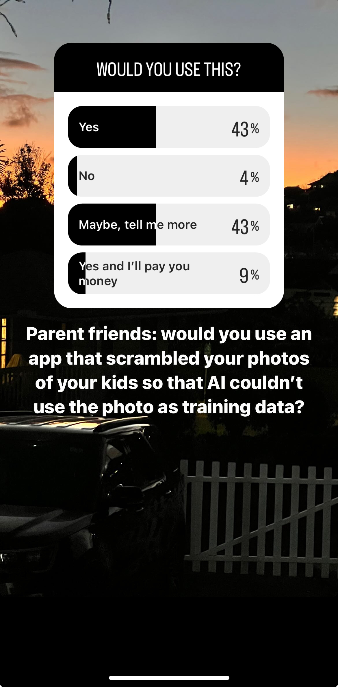

# Building a Mobile App for Parents to Opt Out of AI Training Data
## Abstract

It's not really a secret that AI is everywhere. It's also not totally apparent to everyone how these models come to be. 
Some groups like artists are keenly aware of what training data is, because they eventually learn that their work is the 
oil that powers AI engines. To that end, there has been little done for those who would like to opt out of their content being used for training.

## Introduction and Motivation
I think I'm sort of split on this. For one, I have enjoyed career success in ML for the better part of a decade and I'm very grateful to have 
worked with some fantastic datasets. Also, I am split on which content of mine is used for AI training datasets. I don't mind if my LinkedIn profile and posts power some LLM that LinkedIn is creating, but I'd rather not have pictures of my kids as training data. 

I was surprised to learn that there is little out there in either academia or in industry that is useful for blocking this. Websites have a robot.txt, but what about my images? What about some content on my twitter? I don't know there. I think it would be useful to have the ability to choose to not add my content. 

I also know that there are large segments of people like parents who would rather err on the side of caution when it comes to their kids. 
I totally understand that and I think it's a good thing. So I think I can help other parents. But I want to check if they care or if this is just something that nerds like me care about and think about. 

## Market Validation
Luckily, I know a solid number of parents. I did some pretty informal polling - first asking friends on social media if they were aware of how training data gets assembled, then asking if they would be interested in a tool that prevents their content from becoming training data. 
A super majority of people in polls said they would be interested so that was enough for me to consider this a solid side project. I might have unintentionally biased results by creating three affirmative answers and 1 rejection answer, but that will have to be something I look at in hindsight. 

It should also be noted that the N of people who responded to this was way higher than a typical post for me personally. I had clearly struck something that intrigued people. 

So I set out to build just this app. 

While thanking everyone for participating in the poll, I also mentioned that I was going to build this app in public, i.e. I would do posts like the one you are reading right now. However, I know that my audience has technical and non-technical people, so I quickly realized that I would have to make this also a little bit of a catch up in "how does AI exactly become?" 
## Education and Marketing
It struck me that just as many people immediately said that they would be interested, but that they wanted to hear more. I took this in one of two ways. 
1. They are interested, but they are unsure of any reason why this is solving a problem (i.e. "I think you know that I have a problem, but I'm unaware, tell me more").
2. They are interested but more from a personal relationship with me and what I'm up to (i.e. "sure, what are you doing these days, telll me more").

I might be biased but I think it's more of the first one, so I did my first little post on how AI models are created. 

In a series of 3 posts, I did am 80,000 foot overview explanation of ETL and how a pipeline eventually becomes a model. 

Then I did a post on how I think we would be able to interrupt that process. 

Going back to my initial motivation, I'm stil prety split. I think that my friends and I are fine with a lot of our content being used for training, but I'm not sure that I want my kids to be used for training. I do emphatically think though that the problem is not anything with any tech company. It's just a problem of optionality.

So I think with all these educational posts and marketing, I really want to strike a balance of "look, AI is an awesome tool" and "but this nuanced part of it needs to be considered." I also definitely don't want to point fingers at tech companies for any sort of bad faith or anything.   

## Building
Ironically, since I'm pretty bad at mobile app development (read: absolute newb), I'm going to rely on AI to build this app. 😂
So far I have the initial setup of the app and my initial algorithms for shielding the user's content. 

I created a little logo, which is the header of this. 

Finally, I decided to go with a Hawaiian name for the app. I chose pale huna off a Google translate: "hidden shield" which felt appropriate for the main output of the app, which is a sort of hidden pane of glass or an invisible shield to the human eye, but very visible to the AI. I chose the Hawaiian words because the word nexus around pale and huna also encompassed a lot of concepts that the app deals with. [Pale](https://wehewehe.org/gsdl2.85/cgi-bin/hdict?e=d-11000-00---off-0hdict--00-1----0-10-0---0---0direct-10-ED--4-------0-1lpm--11-haw-Zz-1---Zz-1-home---00-3-1-00-0--4----0-0-11-00-0utfZz-8-00&d=D16809&l=en) is also "protection," "ward off," and "to deliver, as a child." [Huna](https://wehewehe.org/gsdl2.85/cgi-bin/hdict?e=q-11000-00---off-0hdict--00-1----0-10-0---0---0direct-10-ED--4--textpukuielbert%2ctextmamaka-----0-1l--11-en-Zz-1---Zz-1-home-huna--00-4-1-00-0--4----0-0-11-00-0utfZz-8-00&a=d&d=D4932#hero-bottom-banner) is also "to hide, conceal, disguise," "to hide deliberately." 

Plus, I've been living in Hawaii, and anything I can give back to the ohana here is great!

I'll update when I make some progress. Until then, let's build!