# Picks are in
To catch you up on the last post, we're doing a pool that includes a bunch of analytics to convince my family and friends that ~I know what I'm doing with this data stufff~ 

The picks are in. 

# The Masters 2025 is officially underway. 

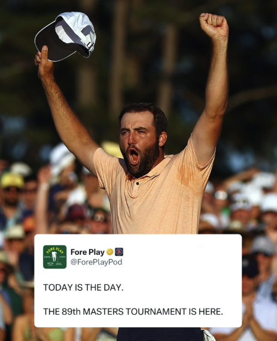

It's been raining on and off at Augusta - should be an awesome week. 

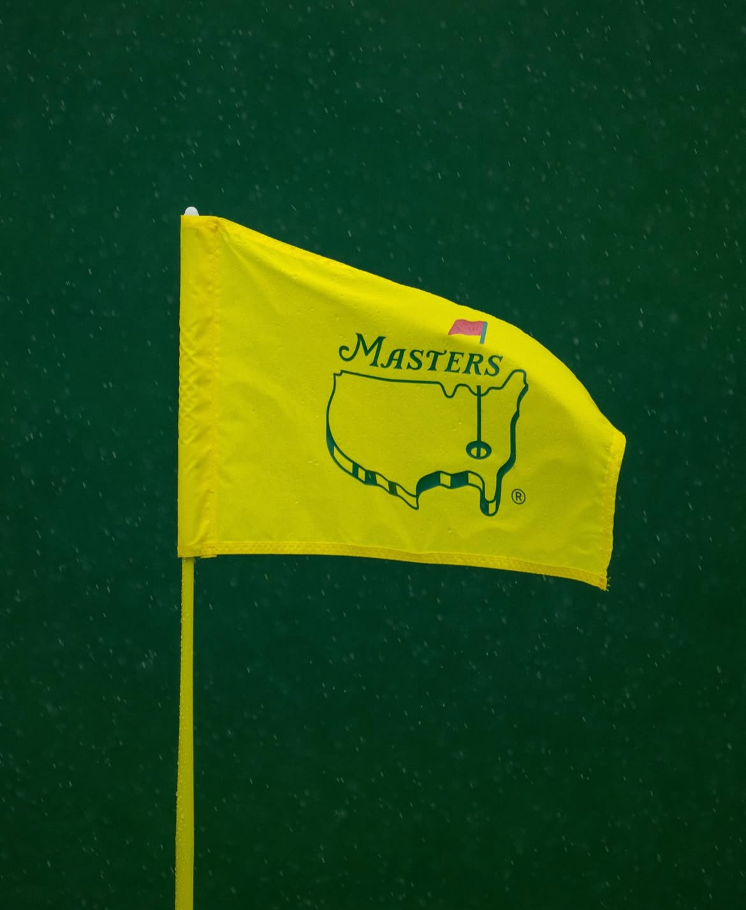
(p.s. what a gorgeous photo huh)

For this pool, we have a larger pool than our previous 3. We do a straight pick of 7 players. Depending on which app you run a pool through, they might avoid ties with a few different systems. I had conversations with several people about this kind of tiering system or a bonus-point system that could help break ties. I might need to implement something like that on the next Major. Since we didn't have it in the rules going into this pool though, I don't think it would be fair to impose something after the fact.

## Now with the golf!
Some cool stories I saw from around the web and then I'll get into the picks. 

According to a bunch of stats, we already have a predicted winner.
[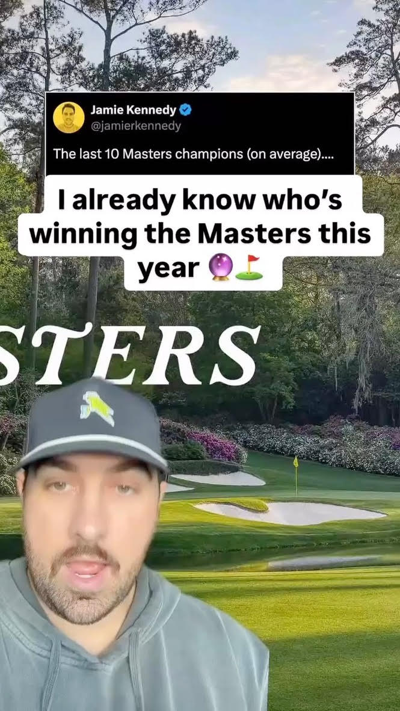](https://www.instagram.com/reel/DIPhXt8xgRJ)

Also, a storyline that I thought was pretty awesome: Rafa Campos is a 36 year old Masters rookie (proving that I still have time). He's a new dad and has missed 13 of 14 cuts. A few days after the birth of his first kid, he wins $1.2mn at the Butterfield Bermuda and secures a spot at the Masters. [Love those dad triumphing stories rn](https://www.espn.com/golf/story/_/id/42448704/new-father-rafael-campos-emotional-first-pga-tour-win)

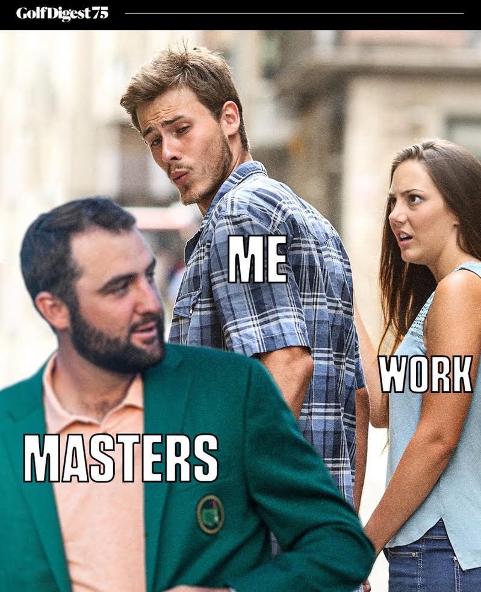
## Speaking of Scottie... 

Our field had a clear favorite in Scottie and Rory. Makes sense: Scottie is returning champion, and he's unlikely to get arrested. Rory seems to always get thiiiiis close. Odds at time of this writing have Scheffler favored:
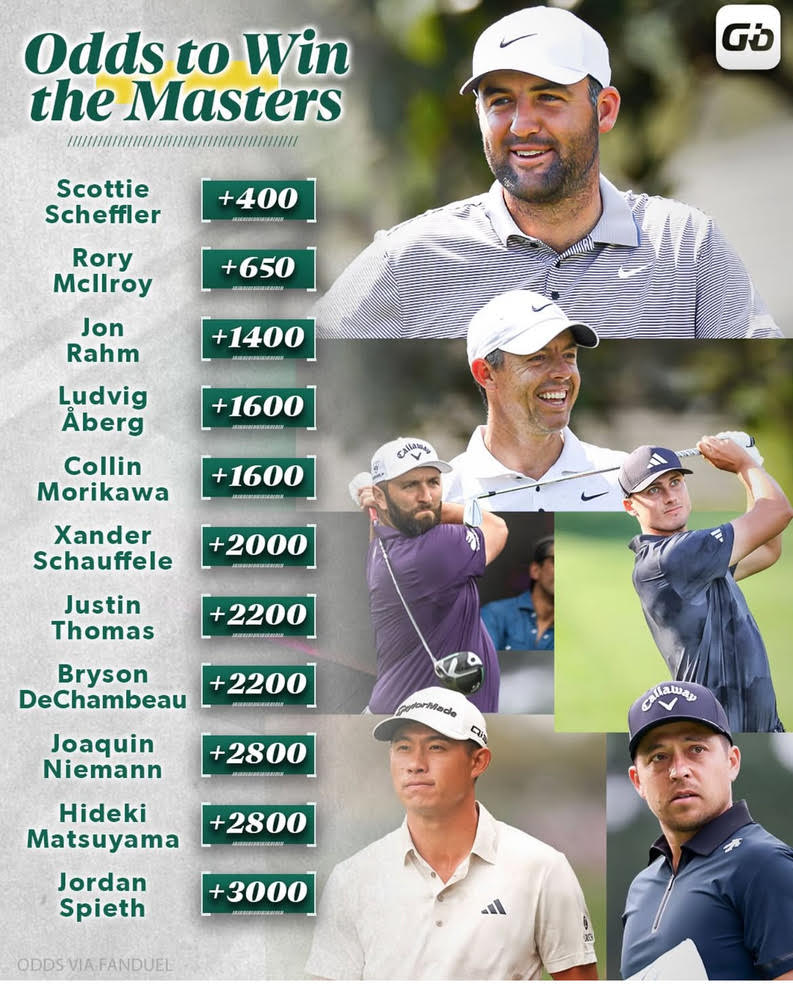
Now onto some visuals about our picks. 

Here's the total time every golfer was chosen by the legends.

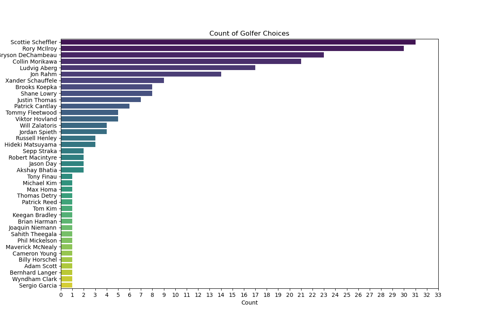

And then given person, here's who chose who (represented in a few different ways):
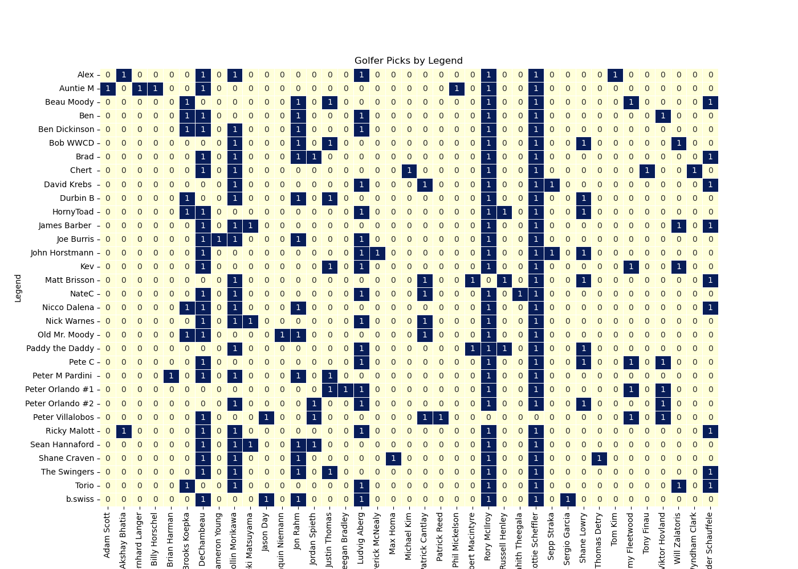
Note: I've been calling everyone who is participating in this "legend" because of The Sandlot.

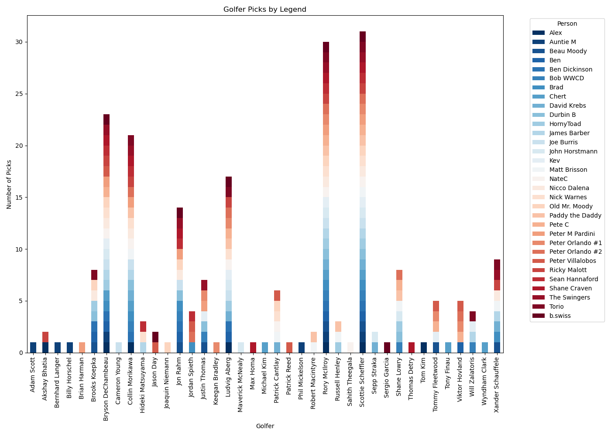
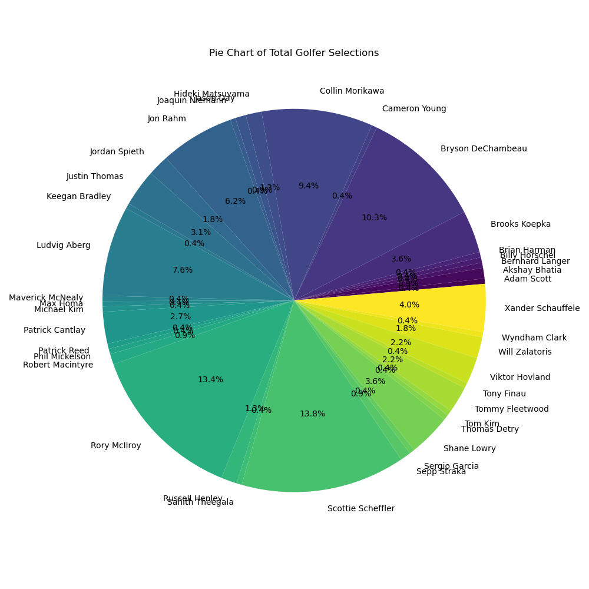
Scottie, Rory, and Bryson are our top three choices amongst the entire group. But not everyone chose them. Let's get into that... 

### A little light commentary/analysis on picks.

Auntie M takes the prize of making the most unique picks, followed by Chase and Shanesaw. Several other people went with 1 person who the rest of the field hadn't selected:
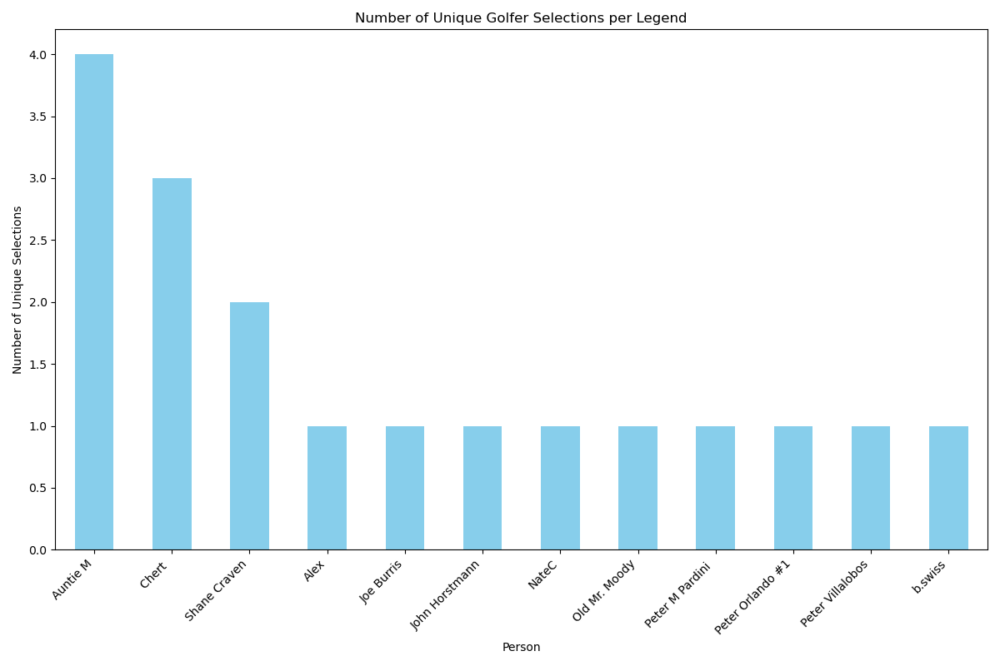

Her choices earned her the unique title - she picked 4 people that no one else did, but my hero is Pete Viallalobos who chose to not pick Rory or Scottie. His picks were the least likely to have more than 1 or 2 overlaps with any other person in the pool. Hope this pays off as much as your practice time at Arroyo. 

What about in the other direction?

### We're all unique, just like everyone else. 

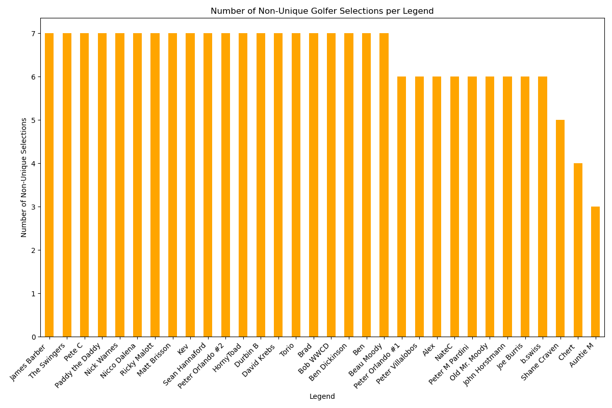

No one had exactly the same picks as anyone else though!

Here's one that looks cool but can be tough to decipher, so I'll show it in two ways. The thing to take out of both of these is the overlap you have with other people who picked. Sort of like a "who am I most like" visual.
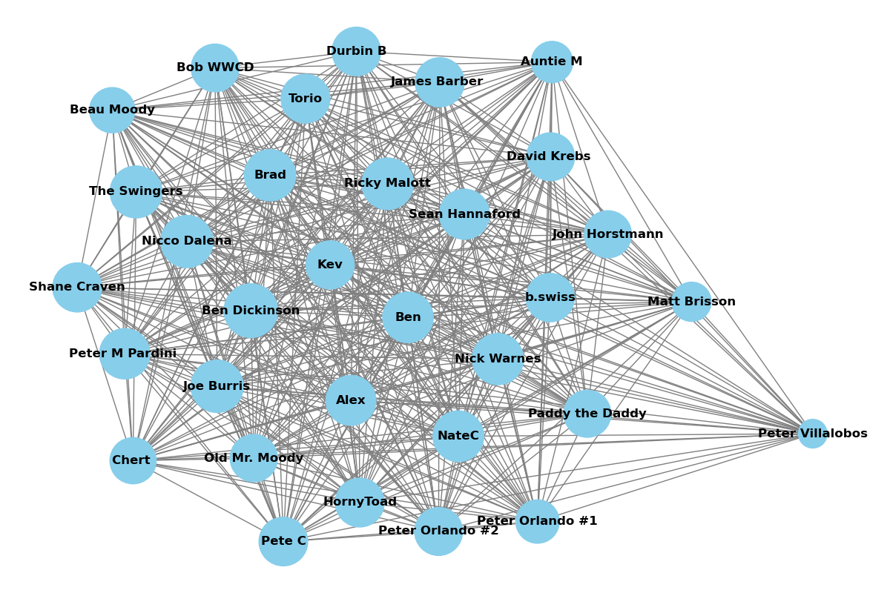
The closer someone is to the middle of that ☝️, the more that they chose people who others chose. On the outskirts are our "no one picked these people but me" - Pete "I like to text Kevin when he three putts because I got a notification on The Grint" Villalobos and Auntie M. Inside though, all cozy, we've got me and Ben Dickinson. Attached is another way to view that visual, called a chord diagram. It's interactive. Download the file and open it up in your browser.

Another way to think about that overlap is how correlated your picks are to another. 
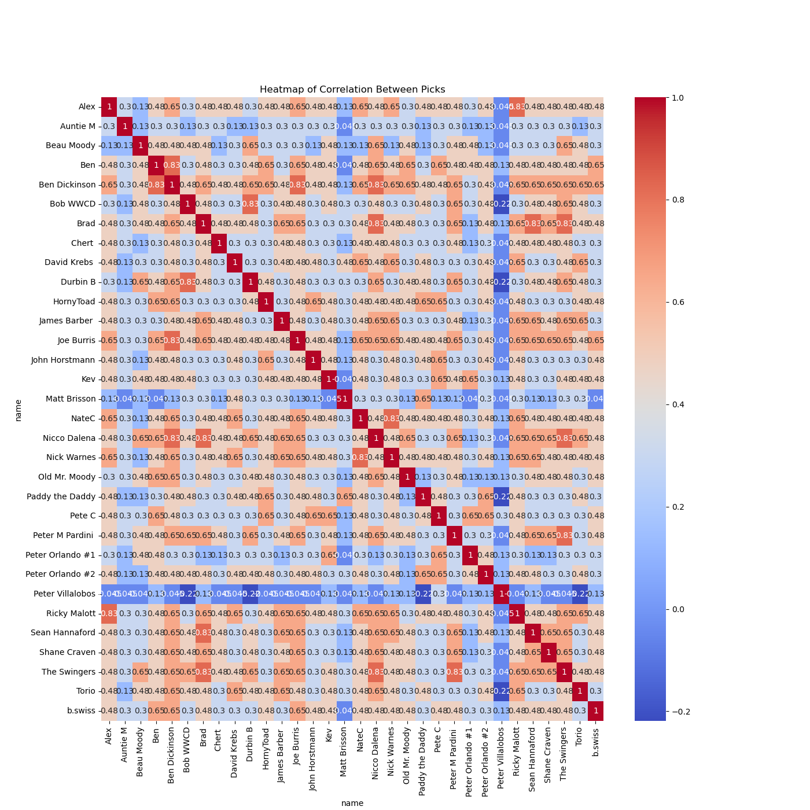
The way to read this one - find a name and someone you want to check against. The more hot/red the tile is that lines up between those two people, the more similar their picks were. So if you look at Matt Brisson or Villalobos for example, you see that they have picks that are dissimilar to a number of people, which is why their tiles are blue, but Nicco or Ben have a lot of red tiles. 

## The site

[Legends Pools](https://www.legendspools.com)

I updated the site to include images. 