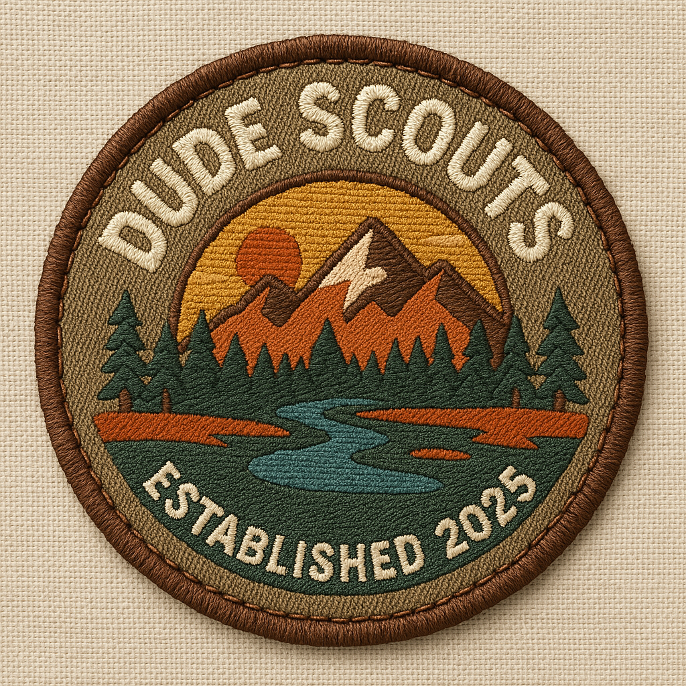

# Let's get social and FAST

I made a couple architecture decisions that might hurt me in the future. I also made an update to the Open Graph social content which probably won't hurt anyone (and makes sharing more cool).

## Backend Let's Gooooooo

I wrote the backend with FastAPI. I did this because like a true analytics nerd, I have some vague notions that the future might contain some sort of analytics on these pages? I don't know why. Maybe it's my data science training. I also set up some databases - I'm AWS as my cloud provider so I've got S3 for the video content stuff, Postgres for the relational stuff, and Lambda for some one off jobs. 

I hope I don't stay up late at night regretting this and every other life decision I've ever made.

### First devopsy stuff

I technically started by containerizing a bunch of stuff. However, I added that.

I'm teaching a class on AWS and Terraform with Caltech rn and we're using Localstack to mock AWS services. I really am loving this as a pattern, so I'll keep this up.

## Now with Community

You might recall that a major reason for this whole project is building community. I'm still working through my textbook [_Community Building on the Web_](https://www.amazon.com/Community-Building-Web-Strategies-Communities/dp/0201874849) which is definitely dated but has some gems and evergreen ideas in it. 

### What shipped

- **Full backend scaffold (FastAPI)**
  - New `backend/` service with API routes: `community`, `lessons`, `progress`, `users`
  - Core modules for config, Postgres and DynamoDB access, data models, and services
  - Entrypoints for local server and AWS Lambda
  - Test scaffolding and health check
- **Local dev + infra**
  - `docker-compose.yml` to run backend locally alongside the Next.js app
  - SQL migrations (`migrations/001_create_tables.sql`)
  - Backend packaging (`pyproject.toml`, `requirements.txt`, `Dockerfile`)
- **App APIs and UI**
  - Next.js API routes to mirror backend areas:
    - `src/app/api/community/{questions,answers,votes}/route.ts`
    - `src/app/api/lessons/[lessonId]/route.ts`, `src/app/api/lessons/route.ts`
  - Community screens and Q&A components
  - Trails filter sidebar and layout upgrades
- **Metadata polish**
  - Continued refinement of Open Graph/Twitter metadata on pages like `about`, `module`, `trails`, and dynamic badge pages

### Scope and size

- All in all, I changed 50 files!
- Major areas touched:
  - Backend: APIs, core, services, tests
  - Frontend: Next.js API routes, community UI, trails filter
  - Migrations and app wiring

### Why it matters

- **Real backend**: Move from mock data toward production-ready services (Postgres, DynamoDB/S3 options, LocalStack for dev).
- **End-to-end Q&A**: Community flows backed by database and API endpoints.
- **Sharable content**: Stronger OG/Twitter metadata for clean previews on social.

### Notable files

- Backend
  - `backend/app/api/v1/{community,lessons,progress,users}.py`
  - `backend/app/core/{config,db_postgres,db_dynamo,models}.py`
  - `backend/app/{main.py,lambda_handler.py}`
  - `backend/requirements.txt`, `backend/pyproject.toml`, `backend/Dockerfile`
  - `backend/tests/{conftest.py,test_health.py}`
- Frontend/API
  - `src/app/api/community/{questions,answers,votes}/route.ts`
  - `src/app/api/lessons/[lessonId]/route.ts`, `src/app/api/lessons/route.ts`
  - `src/components/community/{QuestionForm,AnswerForm,AnswerList,VoteButton}.tsx`
  - `src/components/ui/{sidebar,trails-filter-sidebar}.tsx`
  - `src/app/trails/{layout.tsx,page.tsx}`
  - `src/app/community/{page.tsx,[questionId]/page.tsx}`
  - `src/app/badge/[badgeId]/page.tsx`, `src/app/module/[moduleId]/page.tsx`, `src/app/layout.tsx`

## Better logo!

Last, but most visible to this blog... ChatGPT has a new image model and it is leaps and bounds better than the last model. The new cover image is the result of this!

