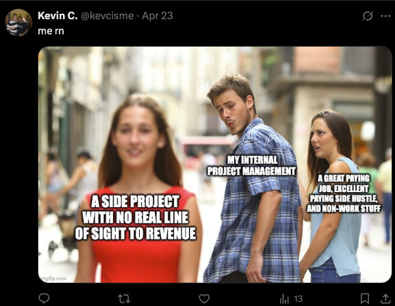
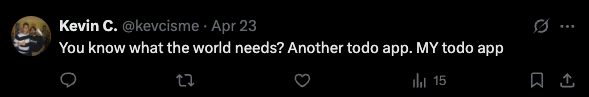
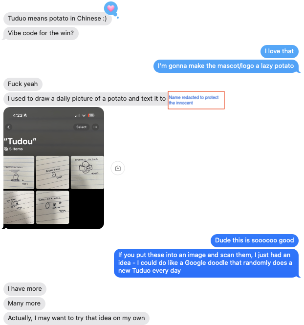

# Ah fuck here we go again
Another day, another side project.

This one has kicked off with way more self awareness though!

My hope here is to actually solve a problem that I have, which is that I am context switching like a mofo these days. When working on multiple projects, I find that I go into goblin mode on one, and the others become sort of like background noise that sounds like that Charlie Brown teacher talking. Someone will say something in a meeting and I just hear the "wah wah, wha wah wha wha wha" while I daydream about what features legendspools.com might have. A week later, person with the blurry voice (usually a colleague with a better title than me) says "_we've been over this_" and I feel bad and then go into goblin mode to fix _their_ problem.

I recognize this pattern but I have no intention of stopping it. 

On this one though, I feel _noble_ in my quest. I'm not encumbered by money. I have no visions of a startup. This is a true, pure, purpose driven attempt to solve a problem for me and others like me. SO what are we doing?!

## Enter.. the side project

Okay hear me out (while I spit this half-baked idea): we build a To Do app.

But I know how LLMs work! So let's also make the core offering here work with an LLM. Here's the idea:

> An app that listens" to everything. Computers are great at remembering everything (I'll probably regret putting this on the internet, for example, because it will live forever). The to-do app connects to the applications you use for work and in your personal life to help you sift through all the noise. It uses AI to understand and generate action items, insight about your work, and prioritize what you need to get done. It's like an assistant who is everywhere you are.

Sounds easy enough? I like this one because I can visualize input/output. Also, this is a great chance to do the thing I should have done when I started learning Javascript, which is to build simple apps first, then add the stuff I already know (LLMs/ML) on top of the simple app. 

Also, since we don't care about money 🤗 here, let's make it open source. Cooool. 

(edit: May 9)
## Okay, we have a little "startup" at home

I was talking with a good friend (about the Toduo concept) who is fluent in Chinese and he brought up that "tüdóu is Chinese for potato. Since I tend to obsess over a particular problem, the ease at which a "potato" and just how perfect the concept of overengineering a solution so that I can be a "lazy couch potato" seemed to be too meta/cosmically funny, so a potato it is for our logo!

Meet, Tudou, the Toduo mascot!

This stud spud has a checkmark where a root would be growing, because ✨symbolism✨. 

("Graphic design is my passion!)

Also, I love the idea that we swap out potato designs infrequently. Stole that from my friend and made it my own. You can see at the bottom of the text exchange though that he began to steal the idea back. So I'm posting this blog post as a poor man's trademark. This constitutes "use in commerce."

