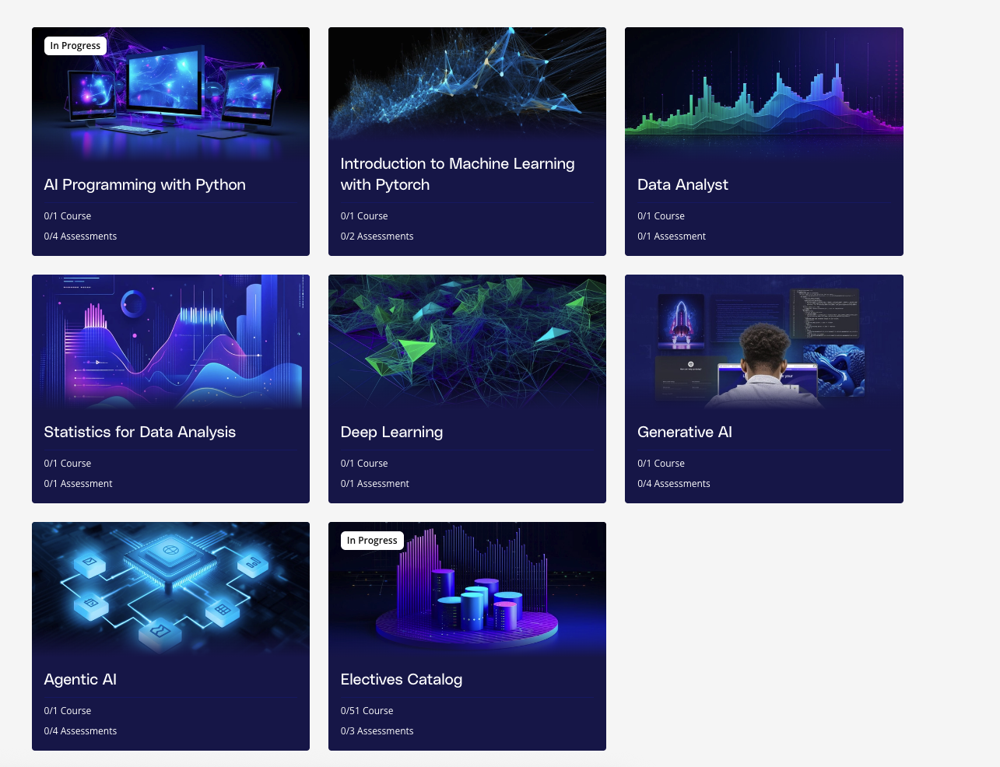
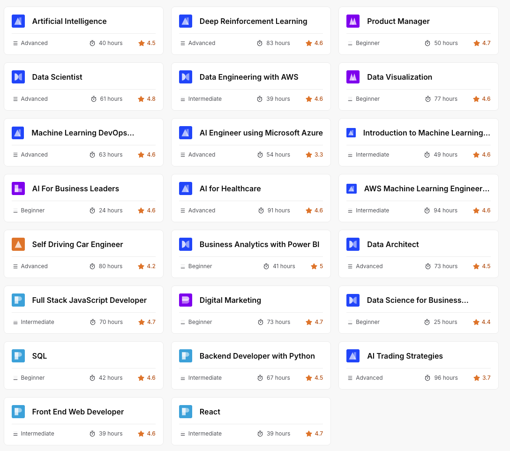
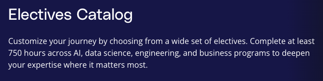
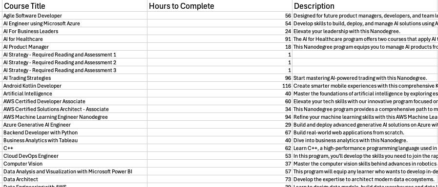

# And in October of '25 he said, let's get a Masters 

In this post, I'm both declaring that this Masters program is one I want to pursue, and deliberating on which courses I should be taking. There's a bit of pontification on how this puzzle pieces into my overall life plan, but I mostly skimp on deep thoughts in favor of action.

If you read my [last post wherein I questioned if an MS in AI was a good idea](https://blog.kevincoyle.xyz/blog/blogpost-251018/) you know that I had more than a few considerations on whether it was a solid move to go get my Masters of Science in AI. Age, career trajectory, transactional payoff of this (or lack thereof), and overall motivations were discussed. 

That was yesterday, and this is today. I'm signed up. I'm ready. Let's do this!

No wait, let's think a little more about this. We're signed up, but which classes should I take? How do those help on my journey here?

### How does this fit into my grand plans?

*AI rendering of me sketching things. I do it upside down*

There's no shortage of projects in my backlog. So how does this plan to get a Masters in AI fit into everything?

## Why _this_ program
I've been looking around at several different online programs. I chose this one because the catalog of courses I can take span every part of tech that I would love to know. If I were to write down a list of "it would be great if I know ___" this program offers it all. So what classes are offered?

### Core Classes
The core consists of 7 "nanodegrees." These look pretty straightforward. I did find it interesting that they offer an Agentic AI class. 

As mentioned, these look pretty straightforward for a foundational layer. What interested me most though were the elective courses, which span not just a number of tech stacks, but also into the business side of tech as well.

### Elective Classes

There 50+ elective classes and it is up to the learner to determine which ones are most relevant. 

*Here's a small sample of the potential elective courses* 

I'm not entirely sure how to curate which courses I should take, but here's my methodology. In order to get the masters, you have to take at least 750 hours of electives. 

I like things in spreadsheets, but unfortunately for me, Udacity only offers this as a web page (and to further disrupt, puts that webpage behind a login, so I'd have to write some sort of Selenium script if I wanted to beautiful soup it). However, being the clever devil I am, I copied the source HTML and then just let Claude parse it into a CSV. A little more ape-y, but it works. 

Now that I've got the courses into this format, I can get a better grasp on what to take. The average course length is 55 hours, but if I remove the three outliers (AI Strategy) which are an hour each, I get an average of 58 hours. I suppose the two things to trade off on here are depth of skillset (like a T shaped or I shaped skill person), and number of hours it takes to finish the degree. I also imagine that I should be trading off between "can I learn this skillset faster outside of this program?" For example, the course on Back-End Development with Python may have less net new content for me, since I am already pretty well versed in a few Python back-end frameworks.

I never have really had a great answer to T-Shape, breadth, vs. I-Shape, depth. I assume that more depth in a particular topic makes me more valuable, but the current offering of courses doesn't go _too_ deep on any one particular subject. I'll bracket any concerns on breadth vs. depth for the moment. I think my best bet is to put these onto a matrix of "impact" vs. "effort" like an Eisenhower Matrix. As a lifelong learner too, I suppose I'd probably explore almost all of these topics, given an infinite time horizon and budget. The question is more _"which courses to take, right now, today"_ and the answer can be more topical. For example, I need to get my interviewing game back up to snuff... maybe the "Data Structures and Algorithms" fits that need best. This committment to lifelong learning (even beyond the fulfillment of graduation requirements and this course) intuitively feels the most correct.

Looking through the courses, I made a "wishlist" of all of the things I wanted to know. I'm going to try to allocate around 15 hours a week to this (which puts me at 3ish hours every day during the work week). This would mean that I could finish the elective requirements in 50 weeks. There's 391 hours across the 7 courses in the Required portion of the masters, which is another 26 weeks. Given vacations, family obligations and all that, I might need to bump total hours a week up to 20 (maybe squeeze 5 in here and there on weekends or days where I feel extra spicy). I could alternatively just resign to finishing this program in 2 years. As of this writing, it's October 2025, which means I'd be finished with my Masters before the little one graduates college (not that I'm competing with her, but going back to the previous post, I think finishing before her provides that encouragement on her own journey). If I _do_ commit to 20 hours a week, that puts me at 57 weeks 😮‍💨. Or maybe I get really lucky and one of these consumer apps takes off so much that I have ["muse"](https://tim.blog/2013/10/28/business-mentorship-and-muses/) and could dedicate more time to studies. 

While we're talking about consumer apps and muses and all that, I'd like to side track and just wonder aloud if this program might have a self-reinforcing loop towards my end goals as an entrepreneur. Some of the courses that focus on making me a better full stack developer, or maybe that work on AI for Trading or Deep Reinforcement Learning might prove to have a really beneficial curriculum for my pocketbook? Would be nice! 

So what to next, if these are the pieces of the game and they are laid out? I think I'm going to start with the Data Structures and Algorithms course, then head back to the drawing board!

Interesting enough, even though this is the highest level of education I've ever attempted (which you think would lend itself to me putting the most brain power into every aspect), I'm basically putting the least amount of scheming into this, compared to other endeavors I've been in. 