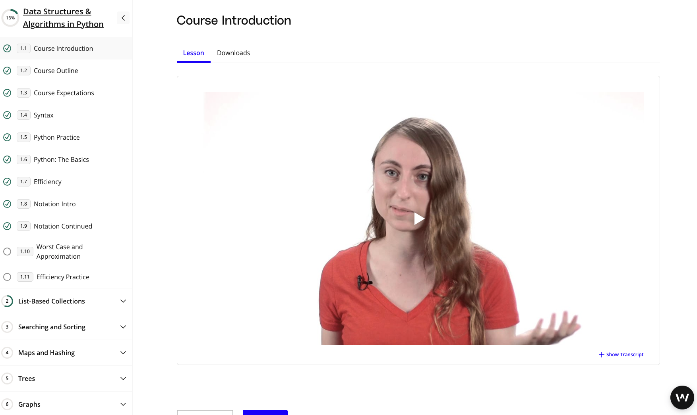

# And in October of '25 he said, let's get a Masters 

I started my first class! If you read my [previous post](https://blog.kevincoyle.xyz/blog/blogpost-251019/) you know I had a "Chidi from _The Good Place_" style overthinking exercise in which class would be my first. I decided in the end though, just let my intuition be the main coefficient and move forward. 

I'm excited to be taking:

## Data Structures and Algorithms

It's no secret that the tech industry has been ravaged by layoffs. I consider myself incredibly fortunate to have skated past all of that unscathed. Nevertheless, I have gotten flabby in the midsection when it comes to interview skills. 
That, and the fact that DS & A are probably one of the most fundamental building blocks have led me to start this journey out with taking this course.

### What's in DS & A?

This course seems to cover the main elements:
- list based collections like arrays, linked lists, and stacks
- searching and sorting like binary search, bubble sorting, merge/quick sort
- maps and hashing like Python dictionaries, maps, hashing, collisions, load factors, hash maps and string keys
- trees like tree traversal, binary search trees, heaps, and tree rotations
- graphs like graph traversal, DFS/BFS, and adjacency matrices
- algorithms like Dijkstra's, knapsack, and dynamic programming 

### A Portugee codes a stack...
In Hawaii, we have a strong Portugeese influence. Malasada donuts, ukuleles, and Bernard Carvalho are all Portugeese and Hawaiian. I was a little shocked to see that the "congrats you passed the coding quiz" is also influenced by our Portugee amigos!

Cheeeeehoooo.

## Topical!
SOO what does this all add up to? Well, I had already begun my re-entry into a lot of these concepts with a Udemy course. This is like a two birds with one stone - I'm going over the material and it counts towards the masters! This Data Structures and Algorithms made a ton of sense to take as my first course. 

Here goes nothing!