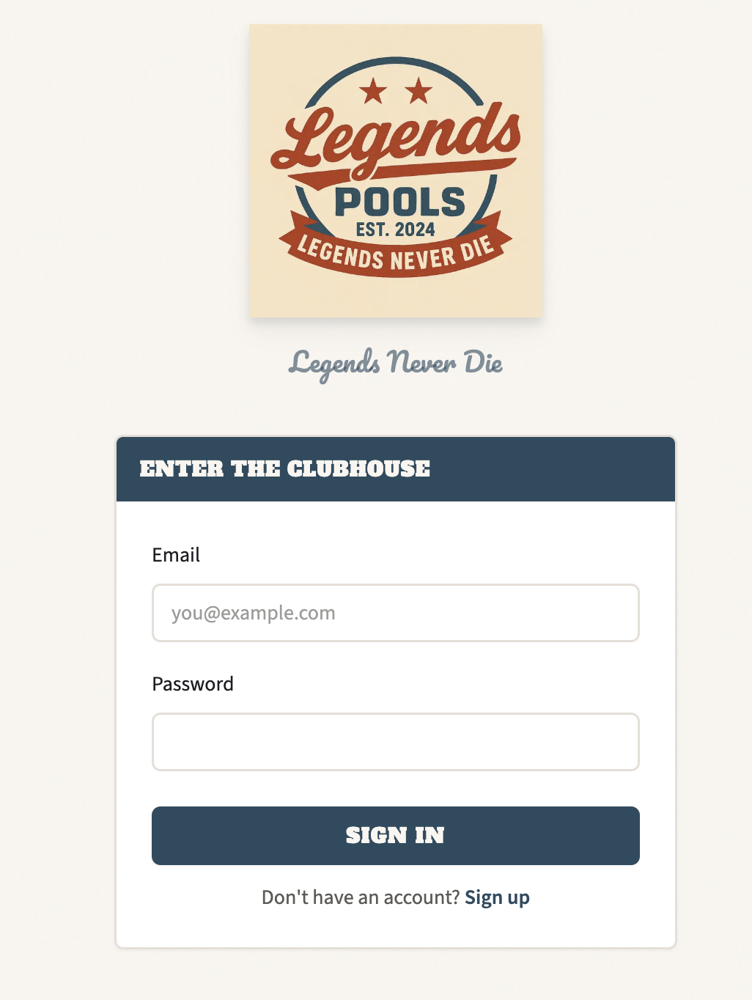
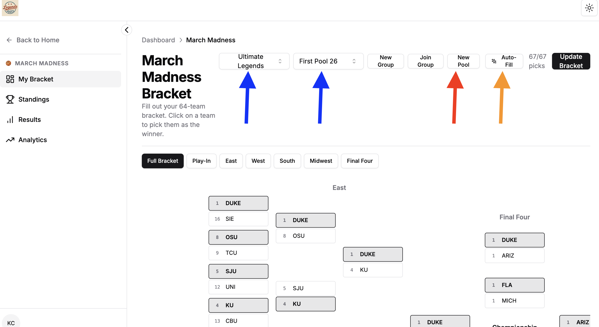
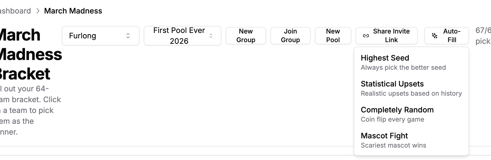

# Picks are in
Selection Sunday is a wonderful time of year. A cabal of hooded priests get together and determine the seedings and brackets for what will be my month long obsession.

This year, not too many surprises as far as picks go. The biggest surprise to all is the introduction of a new pool to March Madness - Legends Pools. The greatest pool site ever. 

The picks are in. 

## Updates in the site

### Login
From a full stack perspective, my powers are growing. I had a really half assed attempt at a login system last year using a third party provider called Clerk. At the scale I'm operating at though, it feels like wayyyy too much overhead. SO I implemented with Nextjs Auth and life is good again. 

### Addition of brackets within groups and pools
I was trying to come up with a sensible way to represent how this is likely a recurring thing (i.e. future groups of people will want to do brackets, and they might want to look back on historical). I think a single group might have multiple pools as well, even if it's not on a time axis (i.e. a signle group might have multiple pools). 

I decided on "March Madness games has groups which has pools." There might be ways I'm not thinking about how this scales yet, so this is subject to change. These are the drop downs pointed at by the blue arrows in the screenshot above.

### New pool
I thought this should be easily shareable as well. In creating a new pool, one assumes the role of admin, which creates a shareable link. This is in the red arrow in the screenshot above.

### Autofill picks
When filling out a bracket, I thought it would be convenient to have an autofill feature. This gives users the option to fill in with 4 potential strategies.

## Why all of this?

In the end, I just want to create a space for community. And I want to make data visualizations. So many data visualizations.

So check out:

## The site

[Legends Pools](https://www.legendspools.com)

I updated the site to include images. 
