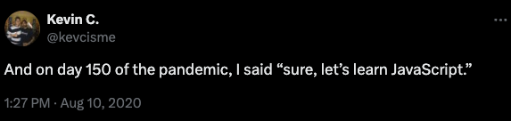

# Learn You a JavaScript

## Motivations

I've decided to learn React. I first need to learn JavaScript. I've heard mixing the sequence of these two can be a bit of a challenge.
Like learning to ride a bike downhill on a mountain.

So I'm taking a zero-to-hero day class in JavaScript and then in September, I'm going to take a 10 week class in React.

Since I teach at General Assembly, I have a benefit of being able to take these classes for free. I also have the benefit of being able to
really embody the spirit of beginner's mind.

Also, it's pretty boring here in the pandemic. Let's keep interacting with new people. 

I am pretty aware that most bootcamps involve a final project. I'm not sure what I'll do yet, but I think it would be cool to build something 
that involves film and predictive analytics, like the stuff I was doing at Warner Brothers.